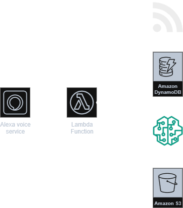

# AI-Powered News Assistant

A Python-based Alexa skill for AI-powered news summarization using LLMs and AWS serverless architecture.

## Features

- RSS feed ingestion from multiple news sources
- AI-powered summarization using LLMs
- Alexa Skills Kit integration
- User preference management
- Serverless AWS architecture ready

## Project Status

This is a proof-of-concept demonstrating enterprise-level architecture and development practices for voice-assistant applications.

## Architecture Diagram

## Tech Stack

- **Language**: Python 3.9+
- **Voice Platform**: Alexa Skills Kit SDK v2
- **Cloud**: AWS Lambda, DynamoDB, S3
- **AI/ML**: Amazon Bedrock, Hugging Face
- **Testing**: pytest, moto
- **CI/CD**: GitHub Actions
